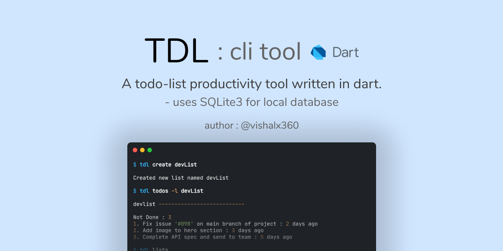

# TDL



# Introduction

This is a command-line todo-list application written in dart (dartlang).
This lets you manage multiple todo lists with ease from your terminal.

# Installation

### Follow the steps to build and install from the source.

### Prerequisites

- [dart]('https://dart.dev/get-dart)
- [sqlite]('https://sqlite.org/download.html)

Step 1. clone this repo.

```bash
git clone https://github.com/vishalx360/TDL.git --depth=1
```

Step 2. change current directory to tdl directory.

```bash
cd tdl
```

Step 3. Install Dependencies (assuming you have dart installed)

```bash
dart pub get
```

Step 3. Compile the source-code

```bash
dart compile exe bin/tdl.dart -o build/tdl
```

Step 4. Copy the generated binary file to /usr/bin dir

```
sudo cp tdl /usr/bin
```

> Note : You can also skip Step 4 and add the path to binary to your PATH env variable by running the following command or adding this command to your shell config file. (for example your `.bashrc` file)
>
> ```
> export PATH=$PATH:/path/to/the/file
> ```

---

## Available Commands

```bash
    Usage : `tdl [command] [option] ...`

    Commands      Description
-------------------------------------------
    create        creates new list.
    add           adds a todo to a particular list.
    todos         display all not finished todos.
    lists         displays all lists.
    remove        removes a particular todo.
    delete        deletes a list.
```

---

## Examples:

```bash
    $ tdl create "myNewList"
    # creates new list
    $ tdl add "add image to footer-section" -l "mynewList"
    # adds this text to "mYNewList",
    # defaults top main_list if list -l not specified
    $ tdl todos -l "mynewList"
    # output >>
    # mynewList ---------------------------
    # Not Done : 8
    # 1 add image to footer-section : a moment ago
    # 2 fix issue in navigation : 1 day ago
    # .......
    $ tdl remove 2 -l "mynewList"
    # removes the todo with specified id
```

<!-- GNU coreutils online help: <https://www.gnu.org/software/coreutils/> -->
<!-- Full documentation <https://www.gnu.org/software/coreutils/cat> -->
<!-- or available locally via: info '(coreutils) cat invocation' -->
